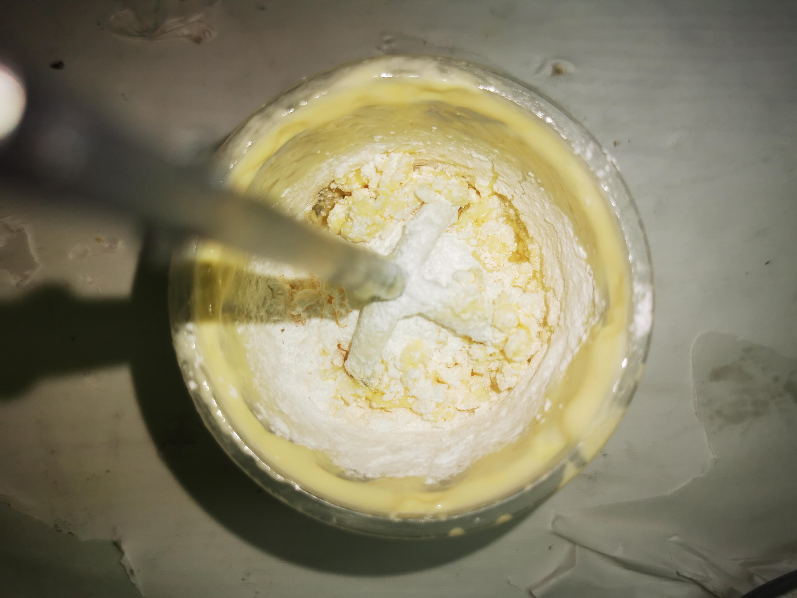
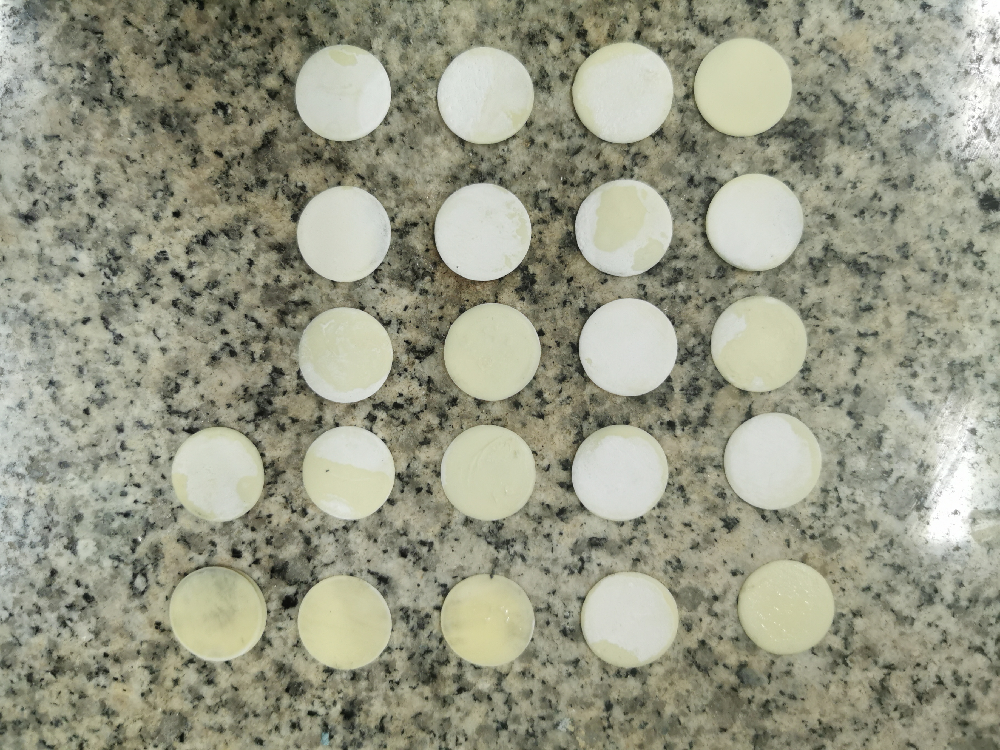
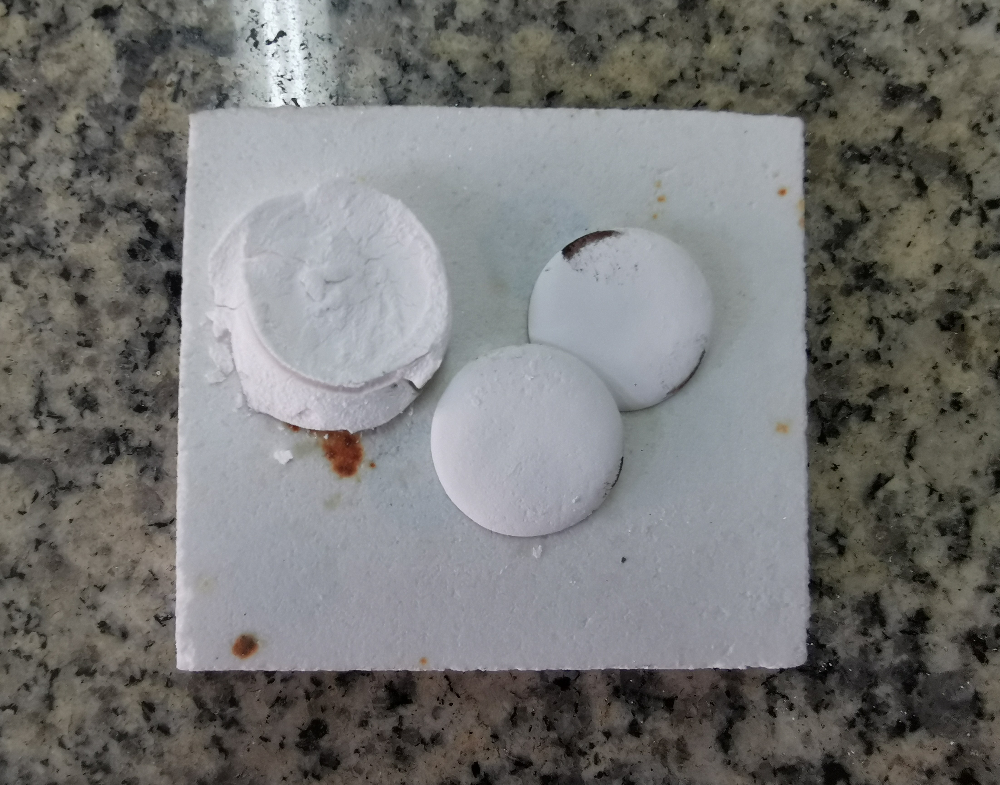
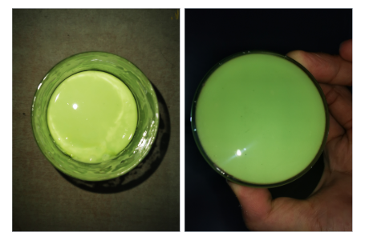
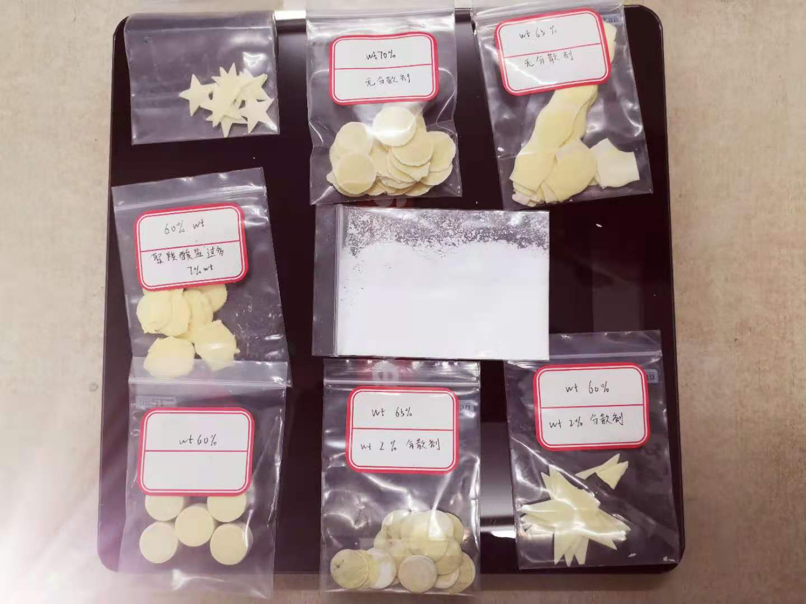
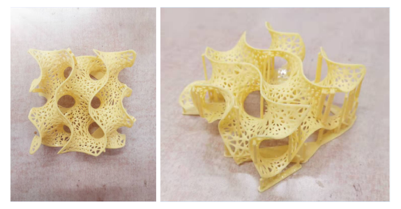
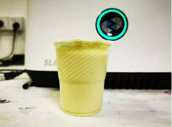
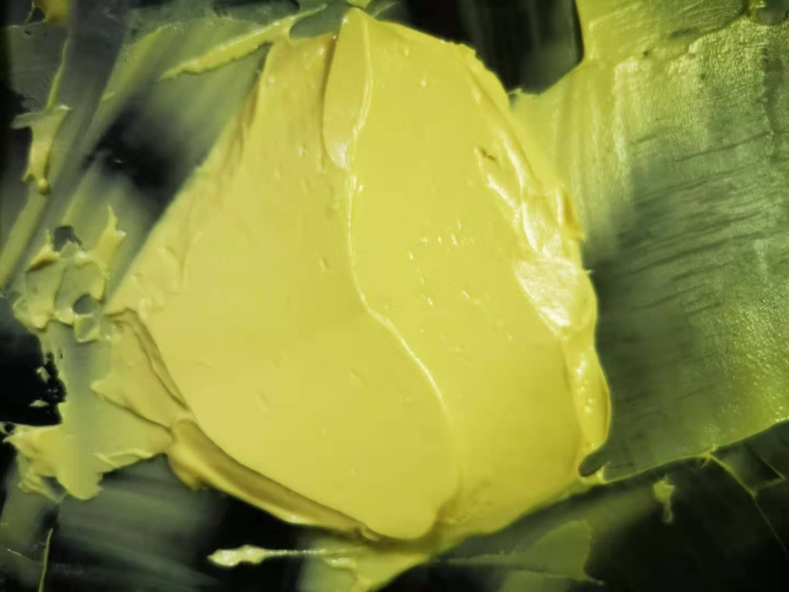

# Experiment Note

张锦程  材84  2018012082

### 1. Introduction 

伴随着工业的快速发展，愈加严重的空气污染一直是影响人们生活健康的重要因素，为了更好地解决空气污染的问题，一个较好的思路是从源头入手，消除工业废气中的污染物，即采用耐高温和耐化学腐蚀的陶瓷基多相催化剂，使得工业废气中的 CO, NOx 等污染物在高温环境中和基体表面的催化剂发生反应以转化为 CO2, N2 等清洁物质。作为催化剂的基体，在保证结构强度的同时，还应当根据工作条件、反应介质的不同，考虑单位质量比表面积和单位长度内压降比等因素。而在研究中，人们发现具有蜂巢状结构的催化剂基体能兼顾流体优化条件、高表面积和足够的强度。

而这样的复杂结构对以挤压成型和流延成型为代表的传统陶瓷成型方法提出了挑战。而 3D 打印以其独特的优势可以克服陶瓷材料复杂成型的困难。

光固化成型 (Stereolithography，SL/SLA) 作为最常见的 3D 打印技术之一，自 Hull 于 1986 年首次提出以来，在世界范围内得到了广泛的应用。它使用特定波长的光源，在含有光聚合单体的容器中选择性地固化液体表面的特定区域。虽然已有 30 多年的历史，然而，对于陶瓷而言，3D 打印成型方法仍然是一种新颖而具有革命性的成型方法。

本研究使用光固化成型作为成型技术，以陶瓷粉末混合光敏树脂作为打印材料，实现多相催化基体有关组件设计的复杂设计，并利用有限元多物理场模拟的方法进行拓扑优化。

### 2. Challenges 

制备这样的打印材料依然有若干挑战，首先浆料应具有适当的流变特性：包括长期稳定性，适当的粘度，均匀性，无严重的颗粒偏析等。快速偏析的不稳定悬浮液会导致制造零件中的材料不均匀。而过高的粘度使得浆料难以在 SLA 打印机中被打印成型。在陶瓷 SL 开发之初，悬浮液粘度必须与商用树脂的粘度相当（小于 3000 mPa·s），而目前的 SLA 也能够以1000 $s^{−1}$ 的剪切速率处理数十 Pa·s 的悬浮液。一方面，较高的陶瓷颗粒含量有利于烧结后收缩更小、密度更大（从而提高机械强度），另一方面，通常需要较低的陶瓷含量，以尽量降低粘度并避免可能的固体成分离析。因此，必须作出平衡，以制备合适的陶瓷浆料。

另一个所必须考虑的关键问题是由添加到树脂中陶瓷颗粒引起的光散射。首先，这种散射不利于紫外光穿透浆料，同时也扩大了固化宽度，这极大地影响了固化单元的重叠行为，从而影响了 SL 的尺寸精度。同时，陶瓷粒子在光固化工作波长下表现出更大的光吸收和折射，这对工艺来说具有很大的挑战性。

### 3. Methodology 

固化精度与陶瓷颗粒大小和体积分数、光照功率和材料的反射指数相关，并有如下的公式描述：
$$
C_d=\frac{2d}{3Q\phi}ln(\frac{E}{E_c})\\
Q=(\frac{\Delta n}{n_0})^2(\frac{d}{\lambda})^2
$$
​                                                                  (公式由米氏散射理论推导而来)

式中 $C_d$ 为固化精度， $d$ 是陶瓷粉末的平均粒径，$ϕ$ 是陶瓷粉末在悬浮液中的体积分数，$λ$ 是辐照的波长，$n_0$ 是光敏树脂的折射率，$Δn$ 是陶瓷粉末与树脂的折射率差，$E$ 是总曝光量，而 $E_c$ 是促使光固化单体聚合的临界曝光量。可以看到，如要提升模型的成型精度，需要陶瓷粉末与光敏树脂的折射率差尽可能地小，体积分数不能太高，平均粒径适当降低。

另外，由于本实验所采用的 LCD 光固化打印机工作波长在 $395nm$ 附近，所以在该波段存在较大吸收峰的物质不适用于采用该成型方法。下图为铁氧体 $ZnFe_2O_4$ 和二氧化锆 $ZrO_2$ 的吸光度曲线，可以看出，铁氧体在紫外段的吸光度较大，相对而言二氧化锆对紫外光的吸收较少，因而是一种更加适合于 SLA 的材料。

为了进一步获取合适的浆料配比和粉末粒径，我们通过理论分析、文献查找和逆向工程相结合的方式。

首先是理论分析。我们假设陶瓷的颗粒为球体，当陶瓷颗粒采用密排结构时，它的结构间隙率为 25.95%，则为了使这些粉末充分分离而不产生空隙，此时浆料中树脂的体积占比应超过 25.95%。

若粉末在空间中呈现完全宽松的随机分布（这更接近实际情况），则由 **Bernal** 等人的研究，这种结构中的孔隙率为 36.34% (Bernal close packing limit)，此时树脂的体积占比应超过 36.24%。由上可以设想实际中的实用浆料树脂占比应在 25.95%~36.34% 之间，对应粉末体积比在 63.66%~74.05% 之间，考虑粉末表面对树脂分子的吸收，实际的粉末含量最好保持在 60% 左右或以下。

图：(a) Fraction of quasiperfect tetrahedra which are also part of polytetrahedra aggregates vs packing density. (b) Fraction of Delaunay simplexes with quasiperfect tetrahedral shape as a function of packing density. (c) Illustration of spatial distribution of the polytetrahedral clusters in packings of hard spheres at 0.64 in experiments left and computer models right.

逆向工程方面，我们对某种商业的陶瓷浆料 (需要专业的陶瓷打印机，打一层需要刮刀刮一次，机器成本较昂贵)  进行热重分析，结果如下所示，上图显示的是热重升温曲线，下图显示浆料中的有机相在 450℃ 附近分解完全，剩余质量在 74.5355% 附近，折合粉末体积比在 58% ($ZrO_2$ $5.85g/cm^3$ ， 树脂密度 $2.3g/cm^3$ ) 附近，和我们的预期一致。

最后，我们通过文献查找，发现当粉末体积占比超过 60% 时浆料的黏度会明显增大，由 Krieger-Dougherty (克里格-多尔蒂) 公式： $\eta_r=(1-\phi/\phi_m)^{-[\eta]\phi_m}$ 描述。同时，当分散剂的质量分数为 2% 左右时，分散剂使得浆料的粘度下降的程度最大 (文献采用酯高分子分散剂 KOS110)。

(a) Viscosity-shear rate curves of photosensitive $ZrO_2$ suspensions with different KOS110 concentrations. (b) Relative viscosity with different KOS110 concentrations at a shear rate of 200 $s^{−1}$. (c) Shear stress-shear rate curves of photosensitive $ZrO_2$ suspensions with different KOS110 concentrations, and the solid lines represent the Herschel-Bulkley Model fitted (solid loading: 40 vol%). 

(a) Viscosity-shear rate curves of photosensitive ZrO2 suspensions with different solid loading. (b) Shear stress-shear rate curves of photosensitive ZrO2 suspensions with different solid loading, and the solid lines represent the Herschel-Bulkley Model fitted. (c) Relative viscosity of dependence on KOS110 concentration at a shear rate of 200 s−1, and the solid line adjustment to the Krieger-Dougherty Model (KOS110 concentration: 2 wt%).

**Table**

Effects of solid loading on Herschel-Bulkley Model parameters of photosensitive

ZrO2 suspensions (KOS110 concentration: 2 wt%). 

| Solid Loading |   $τ_0$   |   $K$   |    n    |  $R^2$  |
| :-----------: | :-------: | :-----: | :-----: | :-----: |
|      30       |  0.04968  | 0.04589 | 0.99799 | 0.99998 |
|      40       |  0.08929  | 0.10350 | 1.02740 | 0.99997 |
|      50       |  0.39400  | 0.40937 | 0.40937 | 0.99998 |
|      55       |  4.09974  | 0.83400 | 0.83400 | 0.99991 |
|      60       | 208.88109 | 0.18487 | 0.18487 | 0.99941 |

为了进一步改善浆料的流动性能以及烧结性能，我们还考察了粉末粒径分布 (PSD) 的影响。先前的理论和实验研究表明，悬浮液中颗粒的适当尺寸分布一方面促进了颗粒在铸坯体中的致密堆积，从而增加了坯体的表观密度；另一方面，悬浮液中粗颗粒的存在会导致剪切薄化 (shear-thinning) 行为，使得压实效率随着粒径分布的宽度而增加。而进一步的研究表明，粗细颗粒的质量比在 7：3 附近时，陶瓷浆料的粘度有最小值。

图：The fitting of Krieger-Dougherty Equation of bimodal PSDs pastes

它的原理可简单地如下图所示：

经过上面的讨论，我们决定选用 1250 目 ($12\ \mu m$) 和 3000 目 ($5.0\ \mu m$) 两种粒径的 $ZrO_2$ 粉末按质量进行 7：3 混合后，再加入总质量 3wt% 的氧化钇，以作为陶瓷粉末部分，而后按照 75% 的质量比配置光固化浆料。混合后的粒径分布可使用激光粒度测试仪进行表征，其结果如下图所示，可以看到经过上述处理后得到了较宽的粒径分布范围。

图：(a) 1250 目 $ZrO_2$ 粉末，$D_{50}=13.080\mu m$. (b) 3000 目 $ZrO_2$ 粉末，$D_{50}=2.725\mu m$. (c) 本实验所用1250 目 $ZrO_2$ 和 3000 目 $ZrO_2$ 7 : 3 混料，得到 $0.5\mu m\sim 100 \mu m$ 的宽峰分布.

在选定了合适的材料以及配置参数后，我们使用计算机建模和流场有限元模拟相结合的方法获得有利于扩大反应有效接触面积的陶瓷基体形状，在有限元模拟的过程中，我们发现这样的三维蜂窝状结构相对于传统有序结构而言能更好地分散介质，从而促进反应的发生；在减少用料的同时，能保持较好的结构强度，测试模型如下：

流场模拟结果如下：

### 4. Experiments

在第一天的实验中，我们采用的浆料混合方式为机械混合，粉末质量分数在 45 wt% 附近。但在实际过程中我们发现这种方式会产生较多气泡，在打印出的试件背板上可以观察到疏孔的存在，如下图所示。第二天的实验中尝试用超声波清洗仪去除气泡，但因浆料粘度过大，气泡难以运动而不太成功。

在第三天的实验中，我们尝试了添加一定量的 SN5040 聚羧酸钠盐型阴离子分散剂 (建议添加量为颜料质量的 0.1 - 1.0%) 。在添加的过程中，我们观察到不同比例的分散剂添加对浆料的物理状态有极大的影响，当分散剂占比在 7% 以上时，浆料不但没有分散，反而凝固成了下图所示的半固态，只有当分散剂控制在 3~2% 以下的适当含量时，才能起到应有的分散作用。同时，我们在昨天的基础上通过将粗细粉末按质量比 7：3 制成宽粒径分布的混合粉末，在保持可加工性（黏度）相同的情况下将粉末的质量分数提升了一半，来到 65 wt% 附近。（换算为体积比为）

(一般而言，分散剂的用量有如下的经验公式：分散剂的用量 (g) = [粉末的比表面积($m^2/g$) $\div$ k]$\times$ 颜料的质量 (g)  （k 为有粉末和树脂性质所决定的常数，$\approx 40$），实验可测得混合粉末的比表面积为 0.7372 m^2/g ，则分散剂用量为：$1.843\ wt\%$ )

成型结果：

而后我们通过在 300~500℃ 温度范围内进行脱脂处理，得到我们需要的陶瓷素胚，如下图所示，可以看到胚体的颜色已经褪去而呈 $ZrO_2$ 固有的白色，试样没有明显缺陷，热重分析表明材料中的有机成分已经完全脱去。

脱脂参数设定：

| 温度/℃         | 130  | 168  | 220  | 300  | 380  | 420  | 431  | 470  | 530  |
| -------------- | ---- | ---- | ---- | ---- | ---- | ---- | ---- | ---- | ---- |
| 保温时间/min   | 2    | 8    | 10   | 14   | 16   | 18   | 16   | 10   | 8    |
| 前加热时间/min | 20   | 9    | 12   | 18   | 16   | 8    | 4    | 8    | 12   |

参考文献的脱脂曲线：

### 附：

沉淀实验结果表明所制备粉末具有较好的稳定性和均匀性，配置时间：10 月26 日，记录时间：11 月 20 日，实验总历时：25 天。

实验所制备的不同配比的样品：

使用浆料制备蜂窝状结构示意图：

浆料的状态：（液态，<60wt%）

（膏状，>70wt%）

