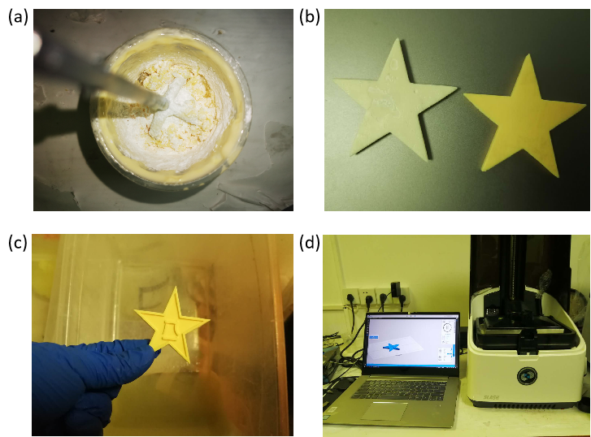

# 个性化 3D 打印个人总结

张锦程&nbsp 2018012082&nbsp 材84

以下为我经过一学期学习后的个人总结，该总结主要分为 3 个部分：理论认识、小组合作、个人思考。

### 1. 理论认识

在上这门课之前，对于 3D 打印的认识只是停留在新闻中的报道、中国制造 2025 中的构想，对这种技术的实现原理在实际生产中的应用的认识还不甚了解。

在这堂课的概论课上，我第一次了解到这门技术的丰富多彩，知晓了如此多的原理和特性各不相同的工程技术：熔融沉积快速成型 FDM 有点像蛋糕店厨师挤奶油的方法，通过在喷口处加热热塑性树脂线材获得流动的浆料，挤出的浆料接触空气很快凝固，以将打印好的图案固定下来，一层一层形状各异的图案最终堆叠成我们所要打印的实体；光固化成型 SLA 技术利用了光敏树脂见光固化的性质，当紫外线光源聚焦形成的图案一层层扫过液态的光敏树脂浆料时，它们的形状便被固定了下来。此外还有选择性激光熔融 SLM、多射流熔融 MJF 等等，不一而足。

而 3D 打印也不仅仅是一种全新的材料成型方法，在智能制造不断发展的当下，3D 打印已经和计算机辅助设计、虚拟仿真、拓扑结构优化等深度结合。比方说，机器视觉和机器学习加到材料喷射技术中，可以提高其准确性，可靠性。而这种技术强大的复杂成型能力，使得许多原本停留在纸面的产品优化设计走向实际，比方说现在结构设计中的拓扑优化策略，可谓互惠共利。

可以说，我们又一次处于时代的风口，正如 1450 年的印刷术、1750 年的蒸汽机和 1950 年的晶体管，当时没有人能正确的预见他们在未来广阔的应用前景，现在也没有人能预测 3D 打印技术会带来怎样的影响。

### 2. 小组合作

在从理论课上了解了 3D 打印技术的发展脉络后，课程进入了技能培训和小组调研合作的阶段。在这一阶段，我们学会了基本的 FDM 打印机操作和打印模型的去支撑等后处理过程，也掌握了神奇的逆向建模技术及其软件使用，三维激光内雕也十分有趣，可以将现在的图像保存到遥远的未来。

学习完必要的技术后，是两份小组合作作业，一份调研，一份模型制作任务。我们小组的初步选题是航空航天方向，经过调研学习，我们对 3D 打印这种先进技术在航空航天中的应用有了更多认识。经过无数科研人员的不懈努力，3D 打印技术在缩短新型航空航天装备的研发周期、降低制造成本、优化零件结构、修复破损零件等方面都有着突出贡献。

在小组合作模型制造的任务上，我们小组中几位会 Solidworks 的同学共同努力，完成了航母及涡轮叶片的建模，虽然后面由于模型破片的原因打印不太成功，但是我们都收获颇丰。

### 3. 个人思考

受到课程的影响，我本人在课后也参与了一个 3D 打印相关材料的设计项目，该项目设计了一种能用于制造多相催化剂基体的陶瓷材料。

作为催化剂的基体，在保证结构强度的同时，还应当根据工作条件、反应介质的不同，考虑单位质量比表面积、单位长度内压降比、流体优化等因素。所以，这样的复杂结构对以挤压成型和流延成型为代表的传统陶瓷成型方法提出了挑战。在这样的基础上，使用 3D 打印技术作为材料成型的手段可以克服复杂成型的困难，大有前途。

在对比了多种 3D 打印技术的优缺点、适用范围和各自成本因素后，我们采用了光固化 SLA 技术。以陶瓷粉末混合光敏树脂作为打印材料，实现多相催化剂基体的复杂设计，并利用有限元模拟的方法进行结构优化。

制备这样的打印材料依然有若干挑战，首先浆料应具有适当的流变特性：包括长期稳定性，适当的粘度，均匀性，无严重的颗粒偏析等。同时还要考虑由添加到树脂中陶瓷颗粒引起的光散射（米散射），从而影响了 SLA 的成型精度。

为了进一步获取合适的浆料配比和粉末粒径，我们通过理论分析、文献查找和逆向工程相结合的方式。最终选定了 1250 目和 3000 目两种粒径的 $ZrO_2$ 粉末按质量进行 7：3 混合后，再加入总质量 3wt% 的氧化钇，而后按照 75% 的质量比配置光固化浆料的配比方式。

在通过 DLP 打印机打印成型后，我们通过在 300~500℃ 温度范围内的脱脂处理，得到我们需要的陶瓷素胚，如下图所示，可以看到胚体的颜色已经褪去而呈 $ZrO_2$ 固有的白色，试样没有明显缺陷，热重分析表明材料中的有机成分已经完全脱去。

总之，我们通过分析尝试，尝试制备了一种适用于 3D 打印的陶瓷材料，也对 3D 打印这种技术的未来有了更多期望。
