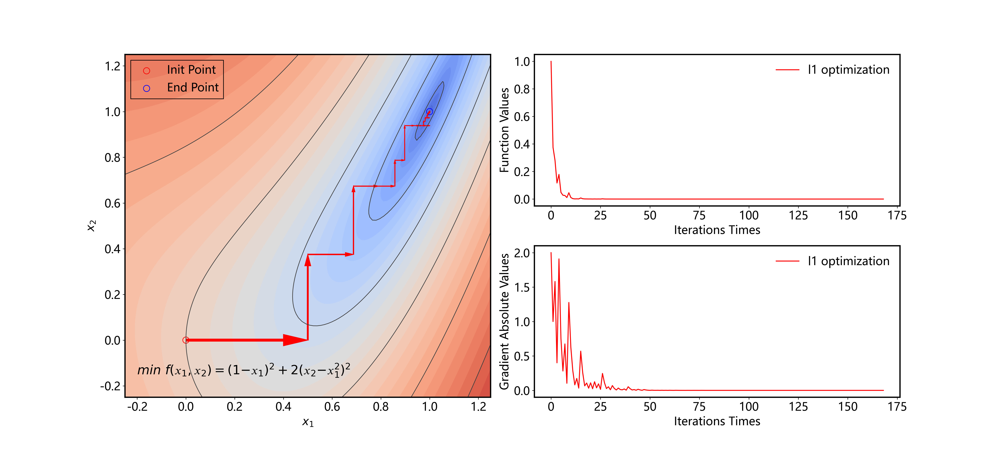
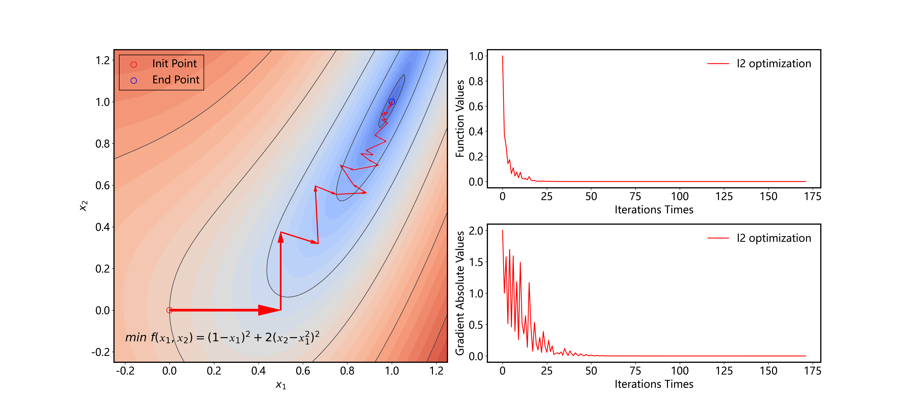
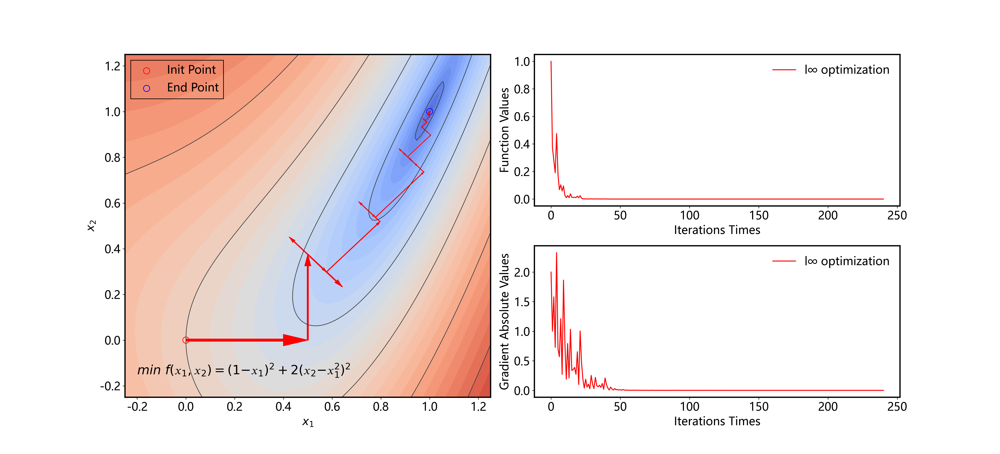

# **运筹学** **2020** **秋季学期第** **9** **次作业**

张锦程  材84  2018012082

##### 考虑无约束优化问题 $min\ 𝑓(𝑥_1, 𝑥_2) = (1 − 𝑥_1)^2 + 2(𝑥_2 − 𝑥_1^2)^2$  。取初始点 $𝑥_0 = [0,0]^𝑇$，用 MATLAB 或者 python 编程实现以下 5 种下降算法求解（要求采用精确直线搜索），终止条件为 $‖∇𝑓(𝑥)‖_2 ≤ 10^{−10}$。给出每种算法的最优解和最优值，并画出采用不同算法时函数值随迭代次数增加的变化曲线。

##### 要求：以文件压缩包方式提交该题，压缩包中应含有程序源代码、求解结果（包括最优解和函数变化曲线的原文件）以及说明文档（PDF），其中说明文档内容为简要说明每种算法的最优值、最优解以及函数值变化曲线。 

###### （1）$𝑙_1$, $𝑙_2$, $𝑙_∞$ 范数最速下降方法； 

###### （2）两种共轭梯度法（Fletcher-Reeves、Polak-Ribiere）。

对于函数 $f(x_1,x_2)$ 在方向 $\vec t=[cos\theta,\ sin\theta]$ 上的一次导数为 $(\frac{\part f}{\part x_1},\frac{\part f}{\part x_2})\cdot\vec t^T$

二阶方向导数为：$\frac{\part^2z}{\part l_2\part l_1}=\vec l_1 \begin{bmatrix} \frac{\part^2 f}{\part x_1^2} & \frac{\part^2 f}{\part x_1\part x_2} \\ \frac{\part^2 f}{\part x_2\part x_1} & \frac{\part^2 f}{\part x_2^2} \end{bmatrix}\vec l_2^T$  

