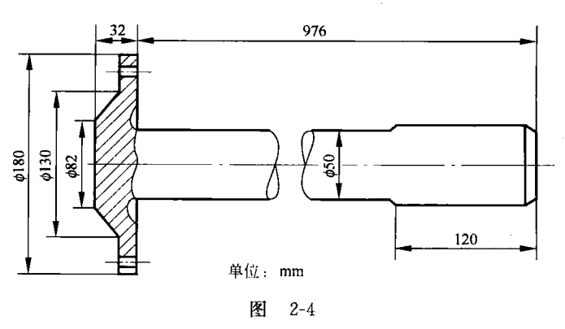
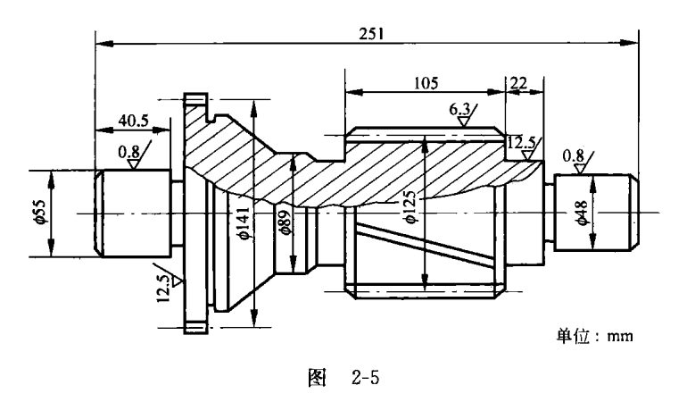
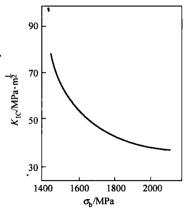

# 课堂讨论4 材料的选择和使用

张锦程  2018012082  材84<center\>
------

## 1.讨论目的

##### （1）熟悉选材的基本原则及一般过程;

##### （2）掌握常用零件的选材步骤,做到正确和合理地选定材料,安排加工工艺路线。

## 2.讨论题

选材是一项比较复杂的技术工作。要做到合理地、正确地选材,除了应堂握必要的理论知识外,还要求具有比较丰富的工程实践经验,并且能善于全面考虑问题,会进行综合的分析和判断。因此,这次课堂讨论只能是学生对选材的一次初步练习。

#### （1）为下列零件从括号内选择合适的制造材料,说明理由,并指出应采用的热处理方法?

##### a.汽车板簧（45、60Si2Mn、20Cr）

**60Si2Mn**：汽车的板簧是一种用于缓冲和吸振的零件，在工作过程中，会收到较大的交变压力和冲击载荷，所以对疲劳强度和屈服极限的要求较高；60Si2Mn 是一种弹簧钢，碳含量高，淬透性好，力学性能符合上述性能要求；作为热处理方法，由于是大型弹簧，故应当采用淬火 + 中温回火处理。（组织：回火T）

##### b.机床床身（Q235、T10A、HT150）

**HT150** **（灰铸铁150）**：机床床身属于较大型的复杂结构铸件，要求能承受中等应力并有一定的铸造性能；HT150属于灰铸铁，它的价格便宜、生产简单、使用性能优良，而且由于石墨的存在，降低了冷却时的内应力，提高了它的铸造性能，符合要求；灰铸铁热处理可采用去应力退火处理以防止变形开裂。（组织：F+P+G片）

##### c.受冲击载荷的齿轮（40MnB、20CrMnTi、KT250-4）

**20CrMnTi**：受冲击载荷的齿轮材料要求有高的强度、疲劳强度、耐磨性、冲击韧性和热处理工艺性能；40MnB 为合金调质钢，KT250-4 为可锻铸铁，20CrMnTi 为合金渗碳钢，相较之下，20CrMnTi 成品抗冲击和耐磨损的能力更强，故选用；热处理工艺为渗碳 + 淬火 + 低温回火。（组织：表面渗碳体 + 回火M + 少量残余A；心部T + 回火M + 少量F）

##### d.桥梁构件（Q345、40钢、30Cr13）

**Q345**：40 钢为优质碳素结构钢，主要用来制造各种机器零件；30Cr13 为马氏体型不锈钢，主要用来做刃具和弹簧，因为碳含量高，不耐腐蚀，所以不适合做结构用钢；Q345 为低合金高强度合金钢，高强度、高韧性、焊接性能良好、冷脆转变温度低、耐腐蚀，相比 40 钢而言更加轻质、可靠耐久、节约建设用料；一般不用热处理，为了改善焊接区性能，可进行一次正火处理。（组织：铁素体+细珠光体（索氏体））

##### e.滑动轴承（GCr15、ZSnSb11Cu6、40CrNiMo）

**ZSnSb11Cu6** **（锡基轴承合金锑11铜6）**：轴承的工况复杂而苛刻，要求有很高的接触疲劳强度、硬度、韧性和淬透性；GCr15（滚动轴承钢铬15）为轴承钢，高碳高铬、冶金质量高，性能符合要求，但是它硬度太高会导致轴颈磨损；ZSnSb11Cu6属于锡基轴承合金，是巴氏合金的一种，它在软基体上分布着硬颗粒相，提高了耐磨性的同时具有良好的自润滑效果，性能符合上述要求；40CrNiMo 为合金调质钢，主要用来制造轴、连杆、螺栓等；就热处理而言，ZSnSb11Cu6 不做热处理。（组织：$\alpha 软基体+\beta' 硬质点+Cu_6Sn_5$）

##### f.热作模具（T10、Cr12MoV、5CrNiMo）

**5CrNiMo**：热作模具工作时承受很大的冲击载荷、摩擦、不均匀热应力，所以选用的材料应当具有高的热硬性、热强性、热疲劳抗力、抗氧化性和淬透性（导热性）；T10 是碳素工具钢，它耐磨性好但热硬性差、淬透性低；Cr12MoV 为冷作模具钢，同样排除；5CrNiMo 为热作模具钢，高碳高合金元素，性能符合要求；相应热处理工艺为淬火 + 高温回火。（组织：回火S + 回火T）

##### g.高速切削刀具（W6Mo5Cr4V、T8、P20（YT14））

**W6Mo5Cr4V** **钨6钼5铬4钒2**：高速切削刀具切削时受到强烈的摩擦，摩擦生热使得刃部温度很高，对材料的硬度、韧性、热硬性都提出了很高的要求；W6Mo5Cr4V 是高速钢，性能符合要求；相较之下，T8 为碳素工具钢，它耐磨性好但热硬性差、淬透性低，（P20 硬质合金也可以）；对应的热处理为球化退火 + 淬火 +三次回火。（组织：回火M + 碳化物 + 少量残余 A）

##### h.凸轮轴（9SiCr、QT800-2、40Cr）？？？？？？不确定答案，三者都有做轴的例子

**QT800-2**（球墨铸铁800-2）：凸轮轴为轴类零件，要求有好的综合力学性能、疲劳强度、淬透性和淬硬性、切削加工性能；9SiCr 为低合金刃具钢；QT800-2 为球墨铸铁；40Cr 为合金调质钢；相比之下球墨铸铁最好，它在性能满足上述要求的情况下，铸造性能好、成本低、生产方便。（组织：P+G球（S+G球））

##### i.轻载小齿轮（20CrMnTi、玻璃纤维增强酚醛树脂复合材料、尼龙66）

**玻璃纤维增强酚醛树脂复合材料**：满足一定性能要求的前提下优先考虑轻量化，**玻璃纤维增强酚醛树脂复合材料**是复合材料，强度满足要求，同时较为轻质，加工容易；相较之下，尼龙66是聚酰胺纤维，虽然强度高且耐磨，但是弹性模量低，容易变形；**压制成形，不做热处理**。（组织：玻璃纤维、酚醛树脂）

##### j.发动机气门（40Cr、4Cr9Si2、Si3N4)

**Si3N4**：发动机气门负责向发动机内输入空气并排出燃烧后的废气，所以对材料的耐高温性、耐腐蚀性有较高要求；40Cr 为合金调质钢，先排除；4Cr9Si2 为马氏体型不锈钢，较耐腐蚀，而且热强性较高；但是 Si3N4 为高温陶瓷材料貌似更好，它的断裂韧性高、耐热冲击、耐磨损，4Cr9Si2 只承受 600 ℃ 以下的高温。

#### （2）汽车半轴是传递扭矩的典型轴件，工作应力较大,且受一定的冲击截荷，其结构和主要尺寸如图2-4所示。对它的性能要求是：屈服强度 $\sigma_s>600 MPa$ ，疲劳强度 $\sigma_{-1}>300 MPa$ ，硬度30～35HRC，冲击吸收功$A_k=47～55J$。试选择合适的材料和热处理工艺，并制定相应的加工工艺路线。

**要求：**半轴在工作时承受冲击、反复弯曲疲劳和扭转应力的作用，要求材料有足够的抗弯强度、韧性、疲劳强度、淬透性、耐磨性，而且从它在汽车上面的用量考虑，应当选择经济实用的钢材；

**选材：**淬透性好要求使用合金钢，韧性和耐磨性要求碳含量不能太高也不能太低，综合性能要求高猜测应采用调质处理，锁定合金调质钢，考虑经济因素和加工性能可选用 40Cr、40CrMo、40CrMnMo 钢；

 同时应指出，从汽车的整体性能来看，设计半轴时所采取的安全系数是比较小的。这是考虑到汽车超载运行而发生事故时，半轴首先破坏对保护后桥内的主动齿轮不受损坏是有利的。从这一点出发，半轴应当是一个易损件，我们使用 40Cr 即可。查表检验，发现 40Cr 满足各项性能的数值要求；

**工艺路线：** 下料→锻造→正火→机械加工→调质→盘部钻孔→磨花键；

**热处理工艺：**锻造后正火。调质处理使得半轴具有高的综合机械性能；

淬火时可选用 850℃ 的油冷淬火，回火温度可选用 520 ℃。回火后在水中冷却，以防止产生回火脆性。同时水冷有利于增加半轴表面的压应力，提高其疲劳强度。

#### （3）一汽车后桥被动圆柱斜齿轮，其形状及尺寸见图 2-5，要求齿轮表面耐磨，硬度为58～62 HRC，轮齿中心的硬度为35～40 HRC，变形量要求尽可能小，齿中心的冲击吸收功A不应小于 55 J，屈服强度 $\sigma_s \geq 840 MPa$ 。齿轮节圆直径为 125 mm，模数 m = 5。试选择合适的材料，制定加工工艺路线，说明每步热处理的目的、工艺规范及组织。

**选材：**20CrMnTi，主要是因为齿轮表面耐磨，而且对于心部韧性（冲击吸收功A）有一定的要求，所以优先考虑适合于渗碳处理的合金渗碳钢，它的各项性能符合要求，而且合金钢淬透性好，便于表面淬火处理。查表得20CrMnTi $\sigma_s \geq 850 MPa$ ，冲击吸收功$A_k \geq 55 J$，退火硬度接近 218 HB 符合要求。

**加工：**下料——锻造——正火 + 完全退火——粗加工——渗碳+二次淬火+低温回火——精加工——检验——入库 

**组织：**齿轮表面：高碳回火马氏体+碳化物+少量残余奥氏体 其他部位：低碳回火马氏体 

**性能：**齿轮表面硬度高耐磨，心部强度高，塑性韧性好，即：表硬心韧

#### （4）一厚板零件,使用 40CrNiMo 钢制造。此钢的 $K_{IC}$ 与 $\sigma_b$ 的关系见图2-6。制造厂无损检测能检测的裂纹长度 $\geq$ 4mm。讨论：


① 如果厚板零件的设计工作应力 $\sigma_d=\frac{1}{2} \sigma_b$。,当
工作应力 $\sigma_d$ 为750 MPa时，允许厚板零件中存在多
长的裂纹？

② 制造厂无损检测能否预测上述厚板零件不发
生脆断?？

③ 如果把 $\sigma_b$ 提高到 1900 MN/m²，允许厚板零件
中存在 4mm 长的裂纹，则允许工作应力是多少?



① $\sigma_b=1500MPa$;   $K_{IC}=65MPa·m^{1/2}$;   

$K_I=Y \sigma \sqrt{a}$,   $Y=\sqrt{\pi}$,   所以$a=2.39mm$  

裂纹长度为 $4.78mm$

② 可以，因为$4.78mm > 4mm$，所以可以无损检测

③ $\sigma_b=1900MPa$; $a=2mm$;  $K_{IC}=Y \sigma \sqrt{a}$;  $Y=\sqrt{\pi}$;  $K_{IC}=49MPa·m^{1/2}$

计算得 $\sigma=618.2MPa$;  所以 $\sigma_d=309.1MPa$

## 3.方法指导

##### （1）本次讨论课可进行现场讨论。讨论前学生
应认真观察 "教学园地“ 展出的各类工程材料及零件
实物，以利于理论与实际相结合。


##### （2）讨论题 (1)、(2)、(3) 由学生课前作好准备，写出发言提纲。课堂上由学生讨论，作出正确的选择和说明，最后由教师做总结。

##### 
（3）讨论题 (4) 在课堂上在教师提示下进行讨论。

##### 
（4）学生将 (1)、(2)、(3) 题讨论和分析的结果写成总结报告，作为作业交给教师。