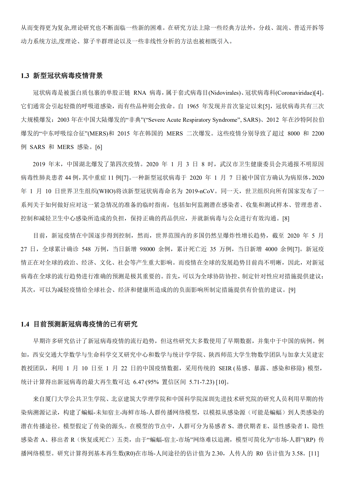
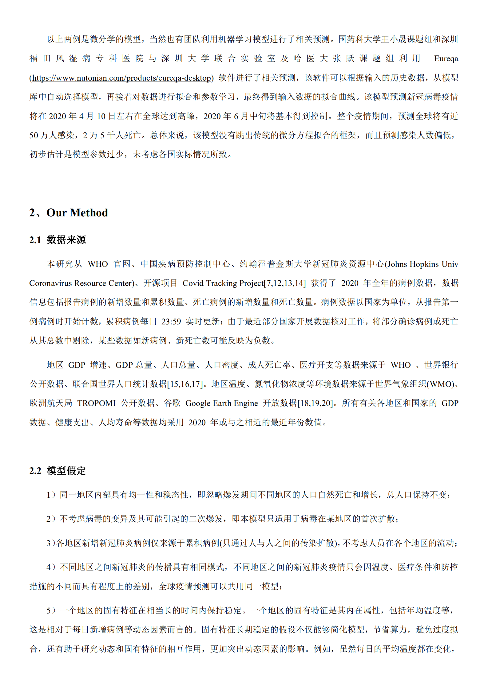
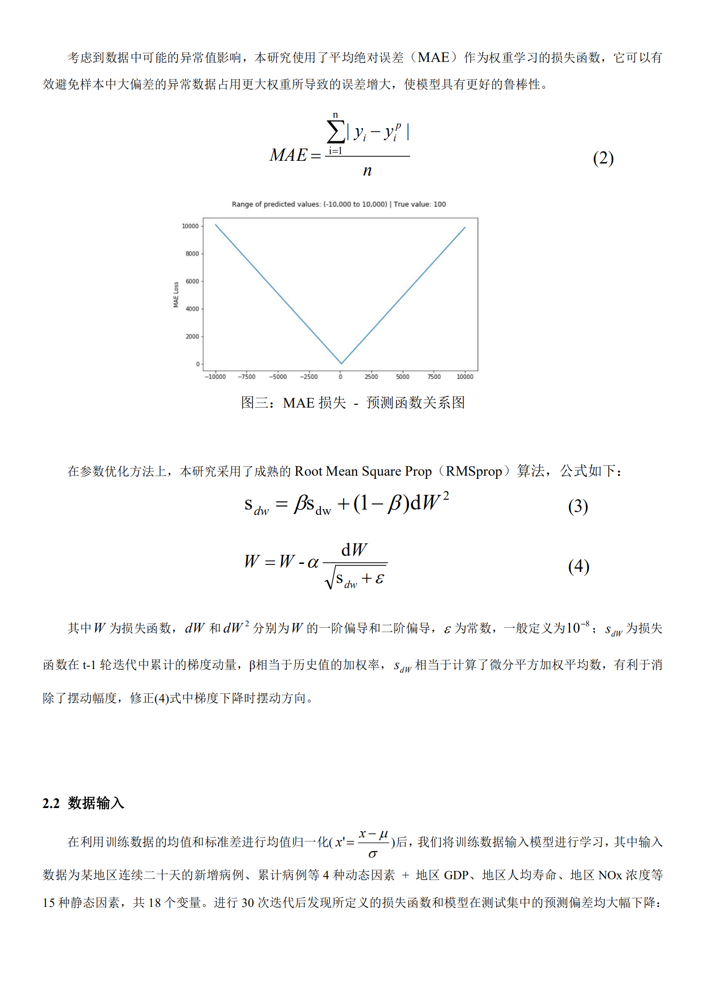
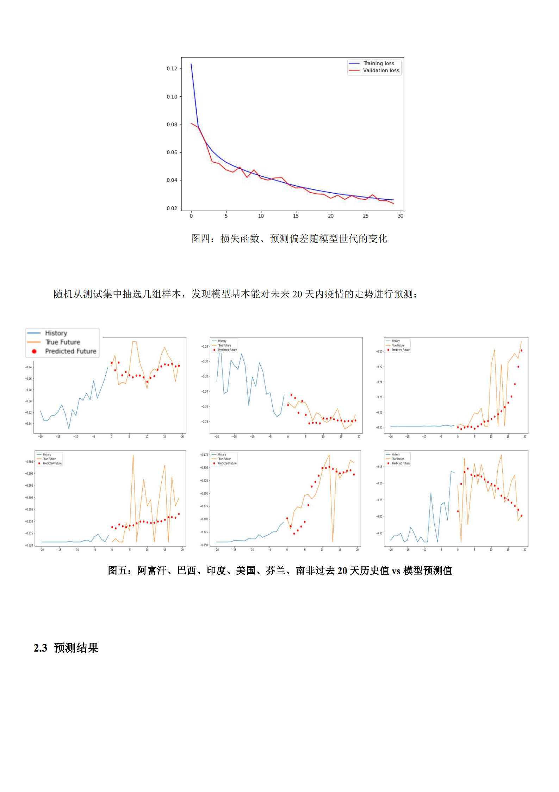
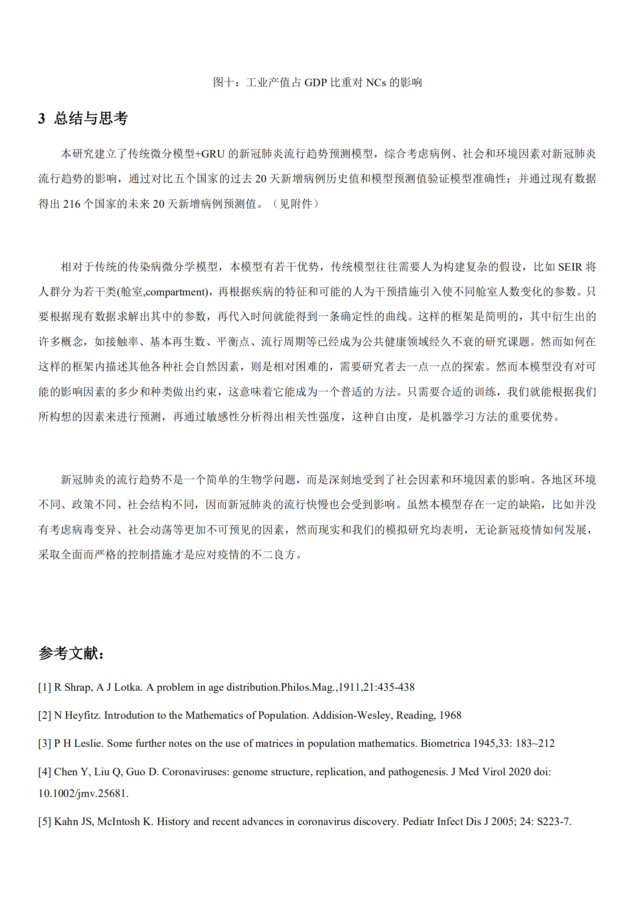

## 灵感：

概率论与数理统计论文参考

[Introduction — statsmodels](https://www.statsmodels.org/stable/index.html)

[关于传染病的数学模型有哪些？ - 知乎](https://www.zhihu.com/question/367466399/answer/982558966?from=groupmessage)

[怎么通俗易懂地解释贝叶斯网络和它的应用？ - 知乎](https://www.zhihu.com/question/28006799)

[BP神经网络_百度百科](https://baike.baidu.com/item/BP神经网络/4581827?fr=aladdin)

[中国城市研究报告-百度地图慧眼](https://huiyan.baidu.com/reports)

[The Dynamics of an SIQS Epidemic Model with Pulse Quarantine - IEEE Conference Publication](https://ieeexplore.ieee.org/document/4597990)

[LSTM实现详解-CSDN.NET](https://www.csdn.net/article/2015-09-14/2825693)

[人人都能看懂的LSTM - 知乎](https://zhuanlan.zhihu.com/p/32085405)

[人人都能看懂的GRU - 知乎](https://zhuanlan.zhihu.com/p/32481747)

[第二十一节，使用TensorFlow实现LSTM和GRU网络 - 大奥特曼打小怪兽 - 博客园](https://www.cnblogs.com/zyly/p/9029591.html#_label7)

[(17条消息)使用Keras进行深度学习：（七）GRU讲解及实践_人工智能_TensorFlowNews-CSDN博客](https://blog.csdn.net/fendouaini/article/details/80272320)

[(17条消息)Keras系列之LSTM和GRU实践_人工智能_Findingxu的博客-CSDN博客](https://blog.csdn.net/findingxu/article/details/86696904)

[Python中利用LSTM模型进行时间序列预测分析 - Arkenstone - 博客园](https://www.cnblogs.com/arkenstone/p/5794063.html)

[World Population Prospects - Population Division - United Nations](https://population.un.org/wpp/Download/Standard/CSV/)

[Our Data | The COVID Tracking Project](https://covidtracking.com/data/)

[Coronavirus COVID-19 (2019-nCoV)](https://www.arcgis.com/apps/opsdashboard/index.html#/bda7594740fd40299423467b48e9ecf6)

[GitHub - CSSEGISandData/COVID-19: Novel Coronavirus (COVID-19) Cases, provided by JHU CSSE](https://github.com/CSSEGISandData/COVID-19)

[一文读懂深度学习时序分析 - 简书](https://www.jianshu.com/p/8f7febd5851f)

[循环神经网络(RNN)笔记——基本结构和静态时序展开 - 知乎](https://zhuanlan.zhihu.com/p/53188763)

[Mortality Analyses - Johns Hopkins Coronavirus Resource Center](https://coronavirus.jhu.edu/data/mortality)

[IRIS Home](https://apps.who.int/iris/)

[SEIR Model](http://www.public.asu.edu/~hnesse/classes/seir.html)

[人类史上八大最严重的瘟疫 | 看世界名画中的瘟疫_plague](https://www.sohu.com/a/371835691_713703)

[新型冠状病毒肺炎_百度百科](https://baike.baidu.com/item/新型冠状病毒肺炎/24282529?fromtitle=COVID-19&fromid=24357637&fr=aladdin)

[2019新型冠状病毒_百度百科](https://baike.baidu.com/item/2019新型冠状病毒/24267858?fromtitle=2019-nCoV&fromid=24267860&fr=aladdin)

[“新冠肺炎” ----时间轴 - 知乎](https://zhuanlan.zhihu.com/p/106844977?utm_source=QQ_article_bottom)

[(26 封私信 / 99+ 条消息) 多位专家预测出新型肺炎疫情拐点即将出现，什么情况下才能说疫情拐点出现？ - 知乎](https://www.zhihu.com/question/368541456/answer/990741343)

[网络模型_百度百科](https://baike.baidu.com/item/网络模型/239980?fr=aladdin)

[预测系统-新冠疫情全球预测](http://covid-19.lzu.edu.cn/ycxt.htm)

[科学家使用机器学习估算病毒季节周期，新冠病毒可能1小时内失活！__财经头条](https://t.cj.sina.com.cn/articles/view/5213469505/136bf3b4102000nt4n?from=tech)

[EDGAR - EDGAR was present at COP23 with: - European Commission](https://edgar.jrc.ec.europa.eu/)

[利用TROPOMI看看疫情期间NO2排放的变化 | bugsuse](https://www.i-lightning.cn/2020/02/gee_tropomi/)

[最新 | 全球NO2交互地图发布，高清卫星观测大气污染_网易订阅](http://mp.163.com/article/DVBUUM1T05149AIR.html;NTESwebSI=0F827B35E49B858A1216EDC338E52D5C.hz-subscribe-user-docker-cm-online-sx6hk-xpxsx-qeltz-6ffbfcxzvj-8081)

[Mapped: nitrogen dioxide pollution around the world - Unearthed](https://unearthed.greenpeace.org/2018/10/29/nitrogen-dioxide-no2-pollution-world-map/)

[应用机器学习方法预测新冠病毒疫情在中国及全球的发展趋势-sci666](http://www.sci666.com.cn/45728.html)

[How to install and use CDS API on Windows - Copernicus Knowledge Base - ECMWF Confluence Wiki](https://confluence.ecmwf.int/display/CKB/How+to+install+and+use+CDS+API+on+Windows)
